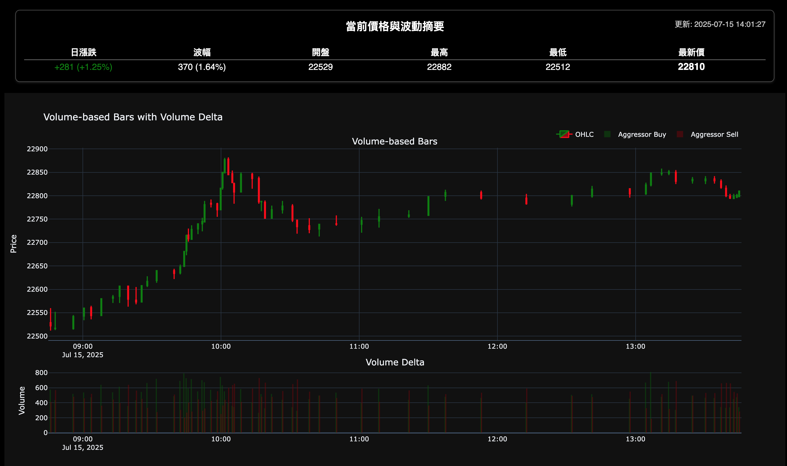
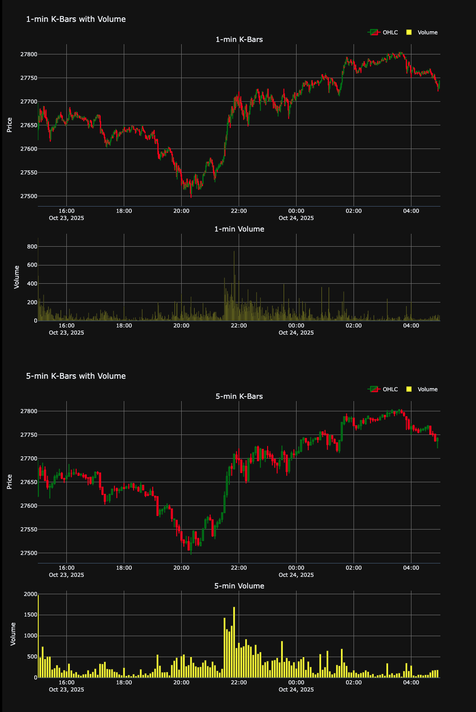
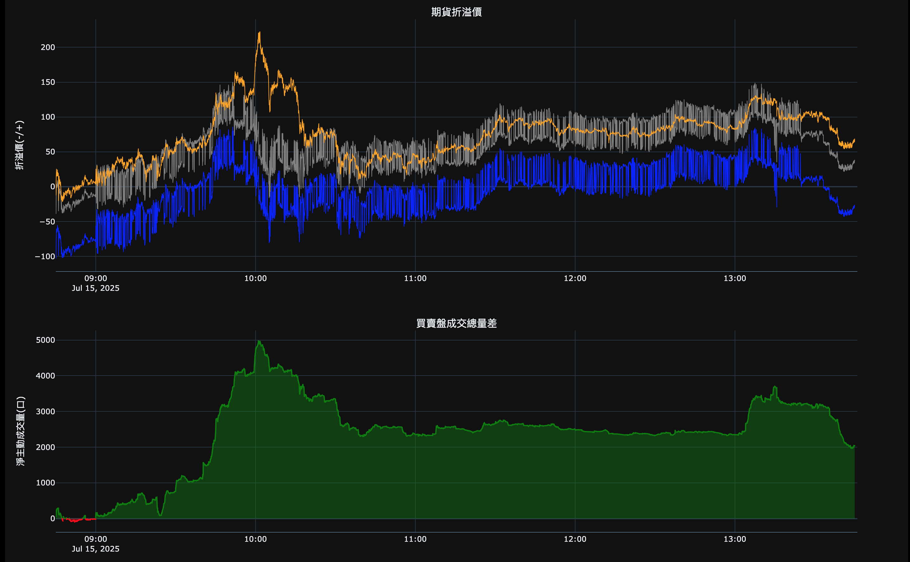
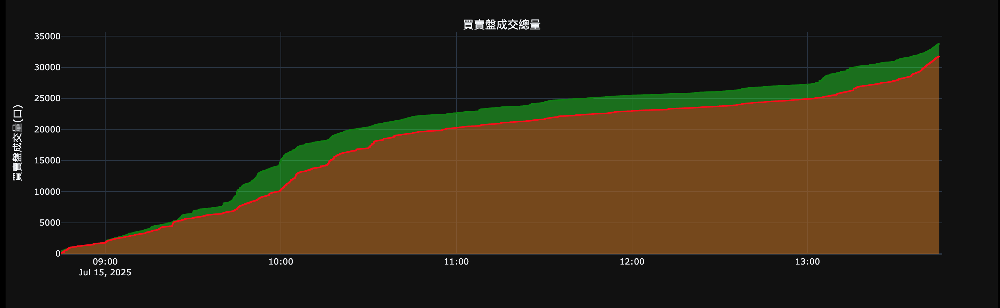

# 📈 台指期貨盤中動態分析儀表板 (TXF Intraday Dynamic Analysis Dashboard)

 
 
 


本專案旨在提供一個視覺化的儀表板，用於即時（或歷史回測）分析台灣指數期貨（TXF）的 tick 級別數據流，並從中洞察盤中多空狀態。

---

## ✨ 主要功能

-   **雙模式數據源**：支援從 `Kafka` 即時消費 tick 數據，或透過 `Shioaji API` 抓取歷史 tick 數據進行分析。
-   **多維度指標計算**：即時計算 **VWAP** (成交量加權平均價)、**盤中高低價**、**累計買賣盤成交量**、**淨主動成交量**以及**期現貨價差**等關鍵指標。
-   **進階圖表視覺化**：
    -   **主分析圖**：整合價格、VWAP、價差、淨成交量於一體的四合一互動式圖表。
    -   **量價K棒圖**：以固定成交口數生成「等量K棒 (Volume Bars)」，並在K棒上標示買賣盤的成交量差 (Volume Delta)。
-   **自動化報告生成**：將所有圖表與統計數據整合為單一的 `HTML` 報告，並支援在即時模式下**自動定時刷新**頁面。
-   **高效率終端監控**：在終端機中提供一個乾淨、會原地更新的狀態面板，方便監控程式運行狀態。

---

## 📸 儀表板預覽





---

## 🛠️ 技術棧

-   **核心語言**: Python 3.9+
-   **數據處理**: Pandas
-   **圖表繪製**: Plotly
-   **即時數據**: Confluent-Kafka for Python
-   **歷史數據**: Shioaji (永豐金證券 API)

---

## 🚀 安裝與設定

#### 1. 複製本專案
```bash
git clone https://github.com/gman-quant/tick-viz.git
cd tick-viz
```

#### 2. 建立並啟用虛擬環境
```bash
# Windows (Git Bash)
python -m venv venv
source venv/Scripts/activate

# macOS / Linux
python -m venv venv
source venv/bin/activate
```

#### 3. 安裝相依套件
```bash
pip install -r requirements.txt
```

#### 4. 進行環境設定
建立.env 設定參考如下:

```python
# tick-viz/.env

# Shioaji API credentials
SHIOAJI_API_KEY="YOUR_API_KEY"
SHIOAJI_SECRET_KEY="YOUR_SECRET_KEY"

# Kafka broker and topic
KAFKA_BROKER='kafka_address:9092'
KAFKA_TOPIC='topic_name_for_realtime-ticks'
```

修改config.py 設定參考如下:
```python
# tick-viz/config.py

# === Time and session configuration ===
TAIWAN_TZ = ZoneInfo("Asia/Taipei") # 時區

IS_REALTIME_MODE = True # 設定為 True 進入即時模式，False 為歷史模式

# 歷史資料查詢設定 (僅在 IS_REALTIME_MODE = False 時生效)
DATE         = date(2025, 7, 7) # 設定歷史模式的日期
DAY_SESSION  = False  # True = 08:30–13:45 (日盤), False = 14:50–05:00 (夜盤)

# === Chart and output settings ===

CLEAR_SCREEN_EACH_CYCLE = True # 是否在每次更新後清除終端機畫面
VOLUME_PER_BAR = 450 # 每多少口數產生一根等量 K 棒
UPDATE_INTERVAL = 12 # 資料更新與前端刷新間隔 (秒)

# === Report generation settings ===

# 報告名稱
REPORT_TITLE = (
    "TXF-Charts-Live"
    if IS_REALTIME_MODE
    else f"TXF-Charts_{START_DATETIME.strftime('%Y-%m-%d_%H%M')}"
)

# HTML 報告輸出路徑
OUTPUT_DIR = Path(__file__).parent / "output" 
```

## 💡 使用方式

-   **即時模式** (`USE_FIXED_END_TIME = False`)：
    -   程式會持續運行，終端機畫面會定時刷新狀態。
    -   HTML 報告會根據 `config.py` 中設定的 `REFRESH_INTERVAL_SECONDS` 自動刷新。
-   **歷史模式** (`USE_FIXED_END_TIME = True`)：
    -   程式會抓取指定時間區間的資料，生成一次性報告後自動結束。

生成的報告會存放於 `output/` 資料夾下（可在 `config.py` 中修改路徑）。

完成設定後，直接運行主程式即可。

```bash
python main.py
```

---

## 📁 專案結構

```
TICK-VIZ/
├── src/                      # 核心原始碼
│   ├── data_sourcing/      # 數據獲取模組 (Kafka, Shioaji)
│   ├── processing/         # 數據處理模組 (指標計算, K棒生成)
│   ├── utils/              # 工具函式模組 (時間處理)
│   └── visualization/      # 視覺化模組 (圖表, 報告生成)
├── output/                   # 預設報告輸出資料夾
├── docs/                     # 存放文件與截圖
├── main.py                   # 專案主執行檔
├── config.py                 # 環境設定檔
├── requirements.txt          # Python 相依套件列表
├── .env.example              # .env 範例檔案
└── README.md                 # 專案說明文件
```

---

## 📄 授權條款

本專案採用 [MIT License](LICENSE) 授權。