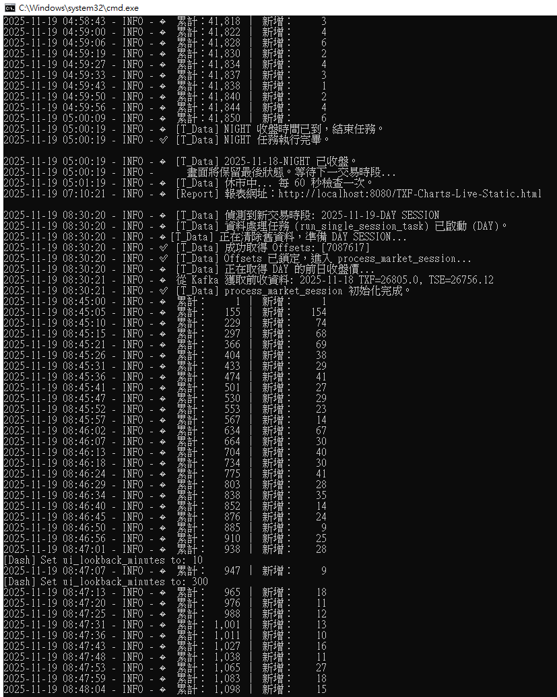
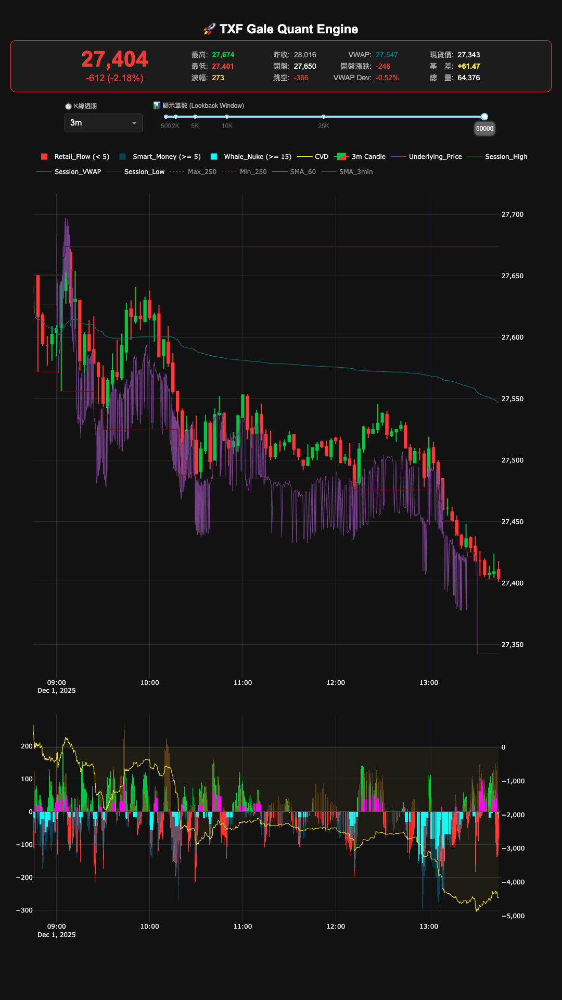

# 台指期即時分析儀表板 (TXF Real-time Dashboard)


 
 


**專為台指期 (TXF) 打造的高效能即時多空分析系統**

核心採用前後端分離架構，將串流 Tick 資料的 ETL 運算與前端 Dash UI 渲染完全解耦。此設計確保了即使在開盤暴量或快市期間，監控介面依然能維持流暢響應，實現「數據不漏、畫面不卡」的體驗。

**流式運算核心**：針對逐筆成交資料進行即時聚合，動態計算 VWAP、Rolling VWAP、量價累積與 1 分 K 線。

**雙模運作機制**：

- **🟢 即時監控**：接收 Kafka 即時串流，提供 24/7 全天候、跨午夜的盤中動態儀表板。

- **🔵 歷史回顧**：整合 Shioaji API 與 Kafka 歷史數據，快速回放盤勢並生成高解析度靜態 HTML 報告。

---

## 儀表板預覽


---

## 伺服器狀態預覽


---

## 進階版（運用相同技術但可以做得更細膩）


---

## 主要功能

-   雙模式資料源：支援從 `Kafka` 即時消費 tick 資料，或透過 `Shioaji API` 抓取歷史 tick 資料進行分析。
-   高效能即時架構：採用多執行緒模型，將資料處理 (data_loop) 與 UI 渲染 (dash_app) 分離，確保即時儀表板流暢高效。
-   多維度指標計算：即時計算技術分析指標 VWAP、High&Low、淨成交強度指標等，可依需求自行設計。
-   進階圖表視覺化：
    -   主分析圖：整合逐筆成交價格及其相關技術分析圖表。
    -   量價K棒圖：多週期的K線圖(1, 3, 5, 10 分)。
    -   日線K棒圖：獨立模組，支援日夜盤分段視覺化。
-   動態儀表板 & 靜態報告：
    -   即時模式：提供基於 Dash 的動態網頁儀表板。
    -   歷史模式：自動生成整合圖表與統計摘要的單一 HTML 報告。

---

## 使用技術

-   **核心語言**: Python 3.9+
-   **Web框架**: Dash (by Plotly)
-   **資料處理**: Pandas
-   **圖表繪製**: Plotly
-   **即時資料**: Confluent-Kafka for Python
-   **歷史資料**: Shioaji (永豐金證券 API)

---

## 安裝與設定

#### 1. 複製本專案
```bash
git clone https://github.com/gman-quant/tick-viz.git
```
```bash
# 進入專案目錄
cd tick-viz
```

#### 2. 建立並啟用虛擬環境
```bash
# macOS / Linux
python -m venv venv
source venv/bin/activate
```
```bash
# Windows (Git Bash)
python -m venv venv
source venv/Scripts/activate
```

#### 3. 安裝相依套件
```bash
pip install -r requirements.txt
```

#### 4. 進行環境設定
建立.env 檔案（可複製 .env.example 內容），並填入以下資訊：

```python
# tick-viz/.env

# -----------------------------
# Shioaji API 憑證
# -----------------------------
SHIOAJI_API_KEY=your_shioaji_api_key
SHIOAJI_SECRET_KEY=your_shioaji_secret_key
# -----------------------------
# Kafka 伺服器設定
# -----------------------------
KAFKA_BOOTSTRAP_SERVERS=your_kafka_address:9092
KAFKA_TOPIC=your_topic_name
```

修改 config/config.py 中的應用程式行為參數：
```python
# (後端：Kafka 沒資料時的最大等待時間)
KAFKA_POLL_TIMEOUT_SECONDS  = 10
# (前端：Dash UI 的畫面刷新週期)
UI_REFRESH_INTERVAL_SECONDS = 5
# (預設時間窗口，可於 UI 動態調整)
DEFAULT_LOOKBACK_MINUTES    = 120
```

---

## 使用方式

先進入專案目錄啟動虛擬環境：
```bash
cd Projects/tick-viz
source venv/bin/activate
```

本專案支援兩種運行模式：

### 🟢 即時模式（`real_time_mode=1`）

- 用於接收來自 Kafka 串流來源的 即時 tick 資料，並啟動 24/7 儀表板。

- 靜態報告：

  - 左上角「⬜️ 點擊生成報告」按鈕。

  - 功能：將目前儀表板的圖表與統計資料，生成一份靜態 HTML 報告，存至 output/TXF-Charts-Live-Static.html。

- 啟動方式：
  
  如未指定 --real-time-mode，預設值為 1。因此一般使用只需：
```bash
python main.py
```
啟動後請開啟瀏覽器訪問 http://localhost:8080

### 🔵 歷史模式（`real_time_mode=0`）

- 用於回測特定日期區間的歷史 tick 資料（可來自 Kafka 或 Shioaji）。

- 功能：

  - 可自訂起迄日期（--date-start, --date-end）。

  - 可分別產出日盤與夜盤報告（--session）。

  - 資料來源選擇（--data-source）。

  - 此模式**不啟動**即時儀表板。

  - 程式會在全部資料處理完畢後自動結束，並將 HTML 靜態報告存於 output/。

- 啟動方式：
```bash
python main.py --real-time-mode 0 --date-start 2025-10-01 --date-end 2025-10-31 --session whole --data-source shioaji
# --session 可選 'day'（日盤）、'night'（夜盤）、或 'whole'（日+夜）
```

### 日線圖更新

- 用於將 tick 資料聚合成日線 K 棒並繪製圖表，此為獨立腳本。

- 功能：

  - 更新 data/daily_txf.csv（包含日盤與夜盤的日線資料）。

  - 繪製日線圖表 output/TXF-Daily-Chart.html。

- 啟動方式：
```bash
# (1) 先將 Parquet 轉為 K 線 CSV
python -m scripts.generate_daily_csv
# (2) 再將 K 線 CSV 繪製成 HTML
python -m scripts.plot_txf_kbar
```

📂 所有輸出報告會自動儲存至 `output/` 資料夾。

---

## 專案結構

```text
TICK-VIZ/
├── config/                       # 📂 專案設定與型別
│   ├── config.py                 # ├─ 全域常數 (API 金鑰, Kafka 主題, 交易時間定義等)
│   ├── run_context.py            # ├─ 執行上下文 (RunContext 資料類別)
│   ├── strings.py                # ├─ UI 介面字串 (Dash App 專用)
│   └── types.py                  # └─ 自定型別與列舉 (SessionType, DataSource)
│
├── data/                         # 📂 本地快取資料 (存放 Parquet/CSV 供回測用)
├── docs/                         # 📂 文件、截圖、開發紀錄
├── output/                       # 📂 預設報告輸出資料夾 (存放 HTML 報告)
│
├── scripts/                      # 📂 【工具腳本】(獨立、批次執行的工具)
│   ├── generate_daily_csv.py     # ├─ 將 Tick 聚合成日 K 並存為 CSV
│   └── plot_txf_kbar.py          # └─ 日 K 繪圖工具
│
├── src/                          # 📂 核心原始碼 (所有應用程式邏輯)
│   ├── core/                     # ├─ 📂 【應用核心】(負責協調、狀態和流程控制)
│   │   ├── orchestrator.py       # │  ├─ 頂層調度器 (啟動即時/歷史模式)
│   │   ├── loop_manager.py       # │  ├─ 【任務核心】24/7 即時管理器、單一任務執行
│   │   └── session_processor.py  # │  └─ 【處理核心】「單一盤別」資料處理迴圈
│   │                               │
│   ├── data_sourcing/            # ├─ 📂 資料獲取 (從 Kafka/Shioaji 取得資料)
│   │   ├── fetch_ticks.py        # │  ├─ 獲取 Tick
│   │   └── market_data.py        # │  └─ 獲取市場歷史資料 (例如：前收盤價)
│   │                               │
│   ├── processing/               # ├─ 📂 【資料處理】(純粹的資料轉換與計算)
│   │   ├── bars/                 # │  ├─ 📂 K 棒合成
│   │   │   ├── time_bars.py      # │  │  ├─ 時間型 K 棒
│   │   │   └── volume_bars.py    # │  │  └─ 成交量型 K 棒
│   │   └── metrics.py            # │  └─ 計算技術指標並準備繪圖用 DF
│   │                               │
│   ├── utils/                    # ├─ 📂 共用工具模組 (時間、資源管理等)
│   │   ├── misc.py               # │  ├─ 雜項工具
│   │   ├── resource_contexts.py  # │  ├─ 資源管理器 (Shioaji/Kafka context)
│   │   ├── session_time.py       # │  ├─ 交易時間計算 (不含 pandas)
│   │   └── time_parser.py        # │  └─ CLI 日期解析
│   │                               │
│   ├── visualization/            # ├─ 📂 圖表與報告產出
│   │   ├── figure_utils.py       # │  ├─ 【新增】Plotly 共用樣式與繪圖輔助
│   │   ├── stats_table.py        # │  ├─ 統計表格生成
│   │   ├── main_chart.py         # │  ├─ 主分析圖
│   │   ├── candlestick_chart.py  # │  ├─ K 棒圖
│   │   └── report_generator.py   # │  └─ 靜態 HTML 報告生成
│   │                               │
│   └── web/                      # └─ 📂 Web/Dash 相關功能
│       ├── dash_app.py           #    ├─ Dash App 的 Layout 與 Callbacks
│       ├── shared_state.py       #    ├─ 【關鍵】跨執行緒共享狀態 (thread-safe)
│       └── assets/               #    └─ 📂 Dash 靜態資源 (CSS/JS)
│
├── tests/                        # 📂 【自動化測試】(確保邏輯正確性)
│
├── main.py                       # 📜 【專案主入口】解析 CLI 參數、委派任務給 Orchestrator
├── requirements.txt              # 📋 Python 套件依賴清單
├── .env.example                  # 🔑 環境變數範例 (API Key/Secret)
├── LICENSE                       # 📄 專案授權
└── README.md                     # 📖 專案說明文件
```

---

## 📄 授權條款

本專案採用 [MIT License](LICENSE) 授權。